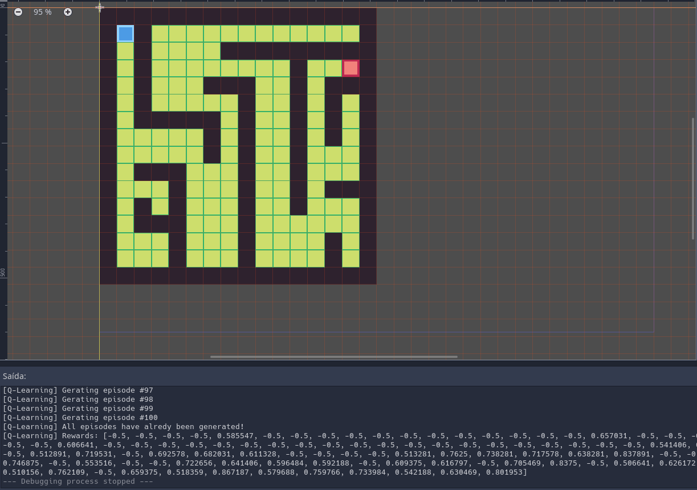

# Godot Q-Learning

## Descriptions
Godot Q-Learning is an implementation of a Q-Table for problems of Reinforcement Learning. It is based on the tutorial series https://simoninithomas.github.io/Deep_reinforcement_learning_Course/

## Using the example


You can use the algorithm however you may want, but it already has a maze example shown as above.
Note that the example comes with:
- 4 Actions: Up, down, left and right;
- 256 States: since the default maze size is (16 * 16).
You can change the default maze however you want, even expand it, but you will need to set the "number of states" based on the new maze.

## Docs
### Signals:  
* newEpisode\(\)  
  
    ```
    Executed when a new episode starts
    ```

* executeStep\(action, arrayToUpdate\)  
  
    ```
    Executed when a new step is requested to be executed
    Requires to update the array passed as a reference like [newState, reward, done]
    ```

  
### Functions:  
* initQTable(startValue: int) -> void  
  
    ```
    Init a Q-Table
    ```

* initQLearning() -> void  
  
    ```
    Init Q-Learning algorithm
    ```

* qFunctionValue(state, action, newState, reward) -> int  
  
    ```
    Get the value of the new Q(s, a)
    ```

* nextEpisode() -> void  
  
    ```
    Run the next episode
    ```

* runAllEpisodes() -> void  
  
    ```
    Run all episodes
    ```

  
### Variables:  
* actionsN: int = `4`  
  
    ```
    Number of actions
    Actions: up, down, left and right
    ```

* statesN: int = `256`  
  
    ```
    Number of states
    Maze of 16 x 16
    ```

* seedToUse: int = `2`  
  
    ```
    Seed to be used on the random number generation, if set to false the seed will be randomized
    ```

* totalEpisodes: int = `100`  
  
    ```
    Number of episodes to generate
    ```

* learningRate: float = `0.8`  
  
    ```
    Learning rate
    ```

* maxSteps: int = `256 \* 5`  
  
    ```
    Max steps per episode
    ```

* gamma: float = `0.95`  
  
    ```
    Discounting rate
    ```

* epsilon: float = `1.0`  
  
    ```
    Exploration rate
    ```

* maxEpsilon: float = `1.0`  
  
    ```
    Exploration probability at the start
    ```

* minEpsilon: float = `0.01`  
  
    ```
    Minimum exploration probability
    ```

* decayRate: float = `0.001`  
  
    ```
    The exponential decay rate for exploration pro
    ```

* rewards: Array = `[]`  
  
    ```
    Accumulated rewards
    ```

* qTable: Array = `[]`  
  
    ```
    The generated q-table (statesN x actionsN)
    ```

* currentEpisode: int = `0`  
  
    ```
    Stores the number of the current episode
    ```

* currentState: int = `0`  
  
    ```
    Stores the current state
    ```

* canRunEpisodes: bool = `false`  
  
    ```
    Store if the algorithm has started
    ```

  
